# Shared fund app — specification

> **For the implementing agent:** section 1 is the contract and section 4 fixes
> the stack. If something is not in section 1, it does not get built. This
> document makes no implementation decisions: how each requirement is satisfied
> is decided at implementation time, as long as the non-functional requirements
> hold.

---

## 1. Specification

### Context

Two people keep separate incomes but share household expenses. Today there is no
visibility into where the money goes. The app must provide it with minimal daily
recording effort.

The central unit is the **fund**: a shared pot of money with its own accounts,
members and history. Personal accounts hang off the fund, not the other way
around. The immediate use case is a household, but nothing in the model depends
on that.

Default language: Spanish. Settlement currency of a new account: COP. Time zone: `America/Bogota`.

### Scope and phases

**Phase 1 (MVP):** RF-01 through RF-48, and RF-54.

**Phase 2:** RF-49 through RF-53. Import, export and audit viewer. No model
changes required: `external_ref` exists from phase 1 so that importing is
idempotent from day one.

**Out of scope:** bank synchronisation, receipt OCR,
accounting exports, native apps. None of this gets built or left
"prepared for".

### Functional requirements

#### Authentication and fund

- [x] **RF-01** — Passwordless email login.
- [x] **RF-57** — Only the group `leader` invites members, edits the group and manages the group's categories.
- [x] **RF-58** — Every member of a group can read all of its accounts (universal read); write is bounded per account — a personal account by its owner, a shared account by any member.
- [x] **RF-59** — Whoever creates a group becomes its `leader`. The role is transferable, but a group is never left without a leader.
- [x] **RF-06** — Accepting an invitation links the user to the member that already exists in the fund, if any; otherwise a member is created.
- [x] **RF-55** — By default a user's accounts are personal; a user may belong to at most one optional shared group. There is no multi-fund membership and no switching.

#### Members and accounts

- [x] **RF-07** — CRUD for members. A member need not have a user.
- [x] **RF-60** — CRUD for accounts. An account is either personal (owned by a user) or a group account.
- [x] **RF-09** — An account is either an asset (savings, cash) or a liability (card, loan).
- [x] **RF-10** — Creating an account captures its opening balance and the date that balance is true as of.
- [x] **RF-11** — Accounts and members that have movements are archived, not deleted.
- [x] **RF-61** — Archiving a member does not archive their accounts. The owner decides per account: archive it or hand it to the group.
- [x] **RF-100** — Only the group `leader` adds, renames, archives, restores and removes a member; every member renames their own row and no other.
- [x] **RF-114** — The accounts list shows each account's balance, derived from its opening balance and its movements and never stored.
- [x] **RF-121** — An account, a group and a person each declare the currency they settle in; what a person declares is what a budget, a goal or a planned payment of their own falls back to when it names no account. A movement carries its own currency, so one account holds several at once — a card bills in pesos and buys in dollars — and a balance derives one figure per account and currency. Amounts are stored as an integer number of hundredths of their currency's major unit, the same scale for every currency; how many decimals a person writes and reads comes from the currency, so one with two decimal places accepts them.
- [x] **RF-122** — A movement between two currencies carries both amounts, each an integer in the one stored scale, hundredths of its own currency's major unit, and a person confirms the second one before it is booked. The rate is their quotient: derived to be read, never stored and never multiplied back out. The app proposes an amount and never imposes one.
- [x] **RF-123** — A card purchase in a foreign currency settles later. The movement books what was spent in the currency it was spent in, and carries the amount a person confirmed it is expected to cost in the account's settlement currency, marked as an estimate. What the issuer actually billed arrives with the statement (RF-129) and replaces the estimate; from then on the two amounts are both settled and the estimate is gone.
- [x] **RF-124** — No surface sums two currencies. A balance, a total and a chart derive per currency and state which one they count.
- [x] **RF-126** — Reading a written amount into the integer a column stores accepts up to two decimals for every currency alike, never capped at fewer because the currency's own convention shows none: a bank posts a savings account's interest, a 4x1000 debit or a settled foreign purchase in centavos whether or not the peso circulates a coin that small. The cap on a typed or imported amount is the column's own stored scale, not what a currency is usually written with; display keeps each currency's own convention (RF-121, RF-125).

#### Debts

- [x] **RF-16** — Paying down a debt is recorded as a transfer from an asset account.
- [x] **RF-78** — A liability account may carry debt terms: an effective annual rate, a minimum payment as a fixed amount or a percentage of balance, a credit limit, a statement cut-off day, a payment due day and an aval.
- [x] **RF-79** — The app estimates a debt's monthly interest from its derived balance and effective annual rate; the annual-to-monthly conversion is effective, not linear.
- [x] **RF-80** — A revolving card exposes its available credit — its limit less its derived balance — its statement cut-off and payment due day, and its minimum payment for the period. Interest, when charged, is a real movement, so the balance stays derived.
- [x] **RF-83** — Consolidated debt view: total owed across all debts, each card's available credit, the summed estimated monthly interest, and the next payment due — each debt's minimum.
- [x] **RF-117** — The consolidated debt view shows the summed available credit across the liability accounts that carry a credit limit.
- [ ] **RF-129** — Every account, asset or liability, keeps a statement history: one immutable record per period with its bounds, the closing balance the statement printed and the opening balance, credits and debits it printed. The difference between that closing balance and the balance derived from the account's own movements, in its own settlement currency, is derived on read and shown, never stored.
- [x] **RF-130** — A liability's statement record also carries what the statement charged for that period: interest, fees and the minimum, as printed. A closed period's statement history shows this charged figure, or that none was recorded; it never estimates a closed period. This does not change how the app estimates the current, still-open period's interest (RF-79).
- [x] **RF-131** — A liability's next payment due derives from its latest statement's cut-off and due dates when one exists; the cut-off and due days on its terms are used only until a statement exists.
- [ ] **RF-136** — A purchase may be deferred into a number of instalments. Its whole amount joins the balance the month it is billed, never fractioned; what the instalment fractions is that line's contribution to the minimum payment. A payment covering the balance extinguishes the plan without penalty, and the statement publishes it already extinguished. The app never concludes on its own that a purchase was deferred: it proposes it and a person confirms.

#### Transactions

- [x] **RF-17** — Record income (destination account only), expense (source account only) or transfer (both).
- [x] **RF-18** — The type is derived from the accounts involved; the user does not choose it.
- [x] **RF-19** — Transfers are excluded from every income and expense report.
- [x] **RF-20** — Every transaction has a positive amount and at least one account.
- [x] **RF-101** — A transfer names two different accounts; a movement whose source and destination are the same account is refused.
- [x] **RF-62** — Both accounts on a transaction belong to the caller's writable scope: their personal accounts and their group's shared accounts.
- [x] **RF-22** — Quick entry: a single text field from which amount, category and description are inferred. Anything inferred stays editable before saving.
- [x] **RF-23** — Listing with filters by date range, creator, account, category and type.
- [x] **RF-89** — The transaction listing also filters by label, alongside the RF-23 filters.
- [x] **RF-127** — The transaction listing also filters by the recurring rule that generated a movement, alongside the RF-23 and RF-89 filters; a rule opens that filtered listing from its own row, and the filtered export (RF-118) carries the same narrowing.
- [x] **RF-24** — Edit and delete transactions.
- [x] **RF-25** — Every transaction records which user created it.
- [x] **RF-69** — Every income or expense splits into one or more (category, amount_cents) rows summing to its amount; a single-category income or expense is one split. A transfer has no splits and no category.
- [ ] **RF-132** — A movement may name the movement that caused it. A caused charge is shown with its cause and is removed with it.
- [ ] **RF-133** — A movement whose counterparty is not known is recorded with the side that is known and waits for review; it counts in every balance, and a person completes it later by naming the other account.

#### Categories

- [x] **RF-63** — CRUD for categories with one level of subcategories, scoped to a user (personal) or a group; a subcategory shares its parent's scope.
- [x] **RF-27** — Each category is either expense or income.
- [x] **RF-64** — Creating a personal space or a group seeds an initial category set in the active language.
- [x] **RF-70** — Labels, independent of category, attach to transactions through a transaction_labels join; a group's labels are managed by its leader, a user's by their owner.

#### Recurring

- [x] **RF-29** — CRUD for recurring rules with monthly, weekly or yearly frequency, and the day that matches that frequency.
- [x] **RF-30** — A daily process turns due rules into real transactions.
- [x] **RF-31** — Generated transactions are distinguishable from manual ones and are editable: the real amount of a utility bill varies.
- [x] **RF-32** — A rule can be paused or given an end date without erasing its history.

#### Budgets, planned payments and goals

- [x] **RF-71** — CRUD for budgets: a spending limit on a category for a repeating period (monthly, weekly or yearly), scoped to a user or a group, optionally narrowed to one account and/or one label.
- [x] **RF-72** — A budget's spent and remaining amounts derive from the transaction splits that fall in the current period and match its category and any account or label narrowing; they are never stored.
- [x] **RF-73** — A budget carries an overspend alert threshold as a percentage of its limit; a budget is flagged once its derived spending crosses that threshold.
- [x] **RF-74** — CRUD for one-off planned payments: a future movement — its accounts, amount, category and due date — with an optional reminder date, kept distinct from recurring rules.
- [x] **RF-75** — Settling a planned payment records the transaction it planned, links the two, and marks the planned payment done; a settled or cancelled planned payment cannot be settled again.
- [x] **RF-76** — CRUD for savings goals: a target amount and an optional target date, scoped to a user or a group.
- [x] **RF-87** — A savings goal's progress — amount saved and amount remaining — derives from its contributions (`goal_contributions`), each an amount set aside virtually with no movement required; it is never stored.
- [x] **RF-119** — A savings goal's contributions are listed with their amounts and dates and one is removed from that list; the goal's progress re-derives from what remains.
- [x] **RF-120** — A budget or a savings goal is archived instead of deleted, and restored from the archive; an archived one leaves the active list and stays readable in its own archived tab.

#### Reports

- [x] **RF-88** — Dashboard: net worth per owner (personal and group), and income, expense and net for the current month.
- [x] **RF-34** — This month's expenses by category, largest first.
- [x] **RF-35** — Six-month comparison of income and expense.
- [x] **RF-66** — Each member's contribution for the month: net of transfers into the group's accounts, less those flowing back to that member.
- [x] **RF-67** — In every report grouped by member, the group's shared accounts appear as their own group. Shared accounts are not split across people.

#### Cash

- [x] **RF-68** — A cash withdrawal goes to the member's own cash account or the group's shared cash, per the group's `cash_mode`.
- [x] **RF-40** — Cash expenses come out of the matching cash account. By RF-19 the withdrawal is not an expense, so the amount is never counted twice.
- [x] **RF-41** — Handing physical cash between people is not recorded: it does not change accounts.
- [x] **RF-42** — Returning cash to a person is a transfer into one of their accounts and reduces their contribution.
- [x] **RF-56** — A group configures its cash (`cash_mode`): a single shared cash account, or one personal cash account per member.

#### Audit

- [x] **RF-43** — Every creation, change and deletion of fund data is logged with what was touched, by whom, when, and the before and after values.
- [x] **RF-44** — No user can edit or delete the log. The only permitted removal is the automatic purge in RNF-14, or a row proven to be the test harness's own: one naming a registered harness identity as its actor or its owner, or, when neither is named, one whose actor and owner are both null and whose action is `DELETE`. A null actor and a null owner together mean a connection that settled no session claims; only the harness's own connections and the recurring generator (RF-30) write without claims, and the generator only inserts, so a both-null `DELETE` row cannot be the generator's and is the harness's.
- [x] **RF-45** — Capture is automatic and no write can bypass it, including those from the recurring process, which are marked as system writes.

#### Language

- [x] **RF-46** — Interface in Spanish and English, with the language visible in the URL. Spanish by default.
- [x] **RF-47** — The preference belongs to the user and holds wherever they sign in, fund or no fund.
- [x] **RF-125** — No interface text is hardcoded. Dates and numbers follow the active language, and an amount is formatted in the currency it is in.

#### Appearance

- [x] **RF-54** — Light theme, dark theme, or follow the system, switchable from the app shell. The choice persists on the device that made it.

#### Import, export and visible audit (phase 2)

- [x] **RF-49** — Download a spreadsheet template with the expected columns and the existing accounts and categories as valid options.
- [x] **RF-50** — Export accounts, members, categories, recurring rules and transactions, in the same shape the import accepts.
- [x] **RF-118** — The transaction listing exports exactly the rows its active filters select, in the same shape the import accepts.
- [x] **RF-51** — Import with preview: everything is validated before anything is written, errors are reported per row, and the user confirms. All or nothing.
- [x] **RF-52** — Re-importing the same file does not duplicate: every row carries a stable external reference and, if it already exists in the fund, it is updated.
- [x] **RF-53** — Read-only audit log viewer, filterable by entity, user and date range.

#### Ingest

- [x] **RF-86** — A user issues, names and revokes per-user webhook credentials; each credential's bearer token is shown once and stored only as a hash, may carry a default account and category the ingest falls back to when the payload does not name them, and a per-credential rate limit.
- [x] **RF-90** — A webhook delivery is stored as a pending proposal, never as a movement: a person accepts it, which records the movement, or rejects it, and a re-delivery of a reference already stored changes nothing.
- [x] **RF-91** — Accepting a complete proposal records the movement in one action; an incomplete one opens the movement form prefilled with everything the delivery read.
- [x] **RF-92** — A message shape is remembered per user: a shape a person silenced arrives already rejected and never waits for review, and a shape never seen before always waits.
- [x] **RF-93** — A merchant's category prefills a delivery's proposal only once that merchant is trusted; it never records a movement on its own.
- [x] **RF-94** — A merchant becomes trusted after two consecutive approvals under the same category, and an approval under a different category marks it ambiguous, which no later consistency undoes.
- [x] **RF-128** — Quick entry and webhook ingest read a bank amount the way the importer does: thousands separators as comma or dot, in either convention, an optional zero-decimal suffix, and up to the two decimals the column stores (RF-126). A finer amount is refused, never rounded; no path drops a cent a person or a bank wrote in silence.
- [x] **RF-96** — Webhook ingest proposes income or expense only when the bank message carries a recognized direction verb; a caller-supplied direction overrides it, and an unknown verb leaves it empty.
- [x] **RF-97** — An account may store its last four digits; webhook ingest proposes the uniquely matching account named by a bank message before falling back to the credential default, while an explicit account override still wins.
- [x] **RF-98** — Webhook ingest proposes the date the bank message carries, written with a two- or four-digit year and interpreted in `America/Bogota`; a caller-supplied date still overrides it, and a message whose date is unreadable or later than the day of delivery falls back to that day.
- [x] **RF-99** — A person sees the message shapes they have silenced, each with the message that silenced it, and returns one to the queue: later messages of that shape wait for review again, and every message of that shape the silence discarded on its own comes back to the queue with it, indistinguishable from one never silenced. A message a person discarded stays discarded.
- [ ] **RF-134** — A movement keeps one source reference per account leg — the statement it came from, the reference that statement gave that leg, and the line within it — so a transfer read from either side's statement is recognised as the movement already recorded, and re-importing a statement replaces exactly that statement's rows.
- [ ] **RF-135** — A counterparty is remembered per user: a description pattern earns an account and a side after two consecutive agreeing completions, and a completion naming a different account marks the pattern ambiguous, which no later agreement undoes. A remembered pattern prefills the missing side and never fills it on its own.

The webhook (RF-90) reuses RF-22 (quick entry), RF-25 (created_by) and RF-45 (no write bypasses audit) unchanged: the same interpreter reads the payload text and the same insert path records the movement, so the created-by stamp and the audit hold as on any manual write. RF-52's idempotency shape is mirrored, not reused — RF-52 stays a spreadsheet-import requirement; the webhook applies the same stable-external-reference rule to its own deliveries. The review queue keeps that reuse: it runs RF-22's interpreter to propose rather than to decide, and RF-25 and RF-45 hold unchanged because an accepted proposal is still written through the same insert path.

### Non-functional requirements

| ID | Requirement |
|---|---|
| RNF-01 | **Zero operating cost.** If a technical decision implies paying, it is discarded. |
| RNF-02 | Fixed stack, the one in section 4. Every library must save a substantial amount of code. |
| RNF-03 | The browser never queries the database directly. Everything goes through the server. |
| RNF-04 | Authorisation is enforced in the database, evaluated against the real session user. Automatic system writes run with their own privileges and are identified as such. |
| RNF-05 | Money is stored as an integer number of hundredths of its currency's major unit — one scale for every currency, whatever its own minor unit is. How many decimals a person types and reads comes from the currency. Floating point is forbidden. Formatting exists only in the presentation layer. |
| RNF-06 | Movement dates carry no time and are interpreted in `America/Bogota`. |
| RNF-07 | Balances are derived from movements. They are never stored in a column that has to be kept in sync. |
| RNF-08 | Mobile-first and installable as a PWA. |
| RNF-09 | The dashboard responds in under 2 s with a year of movements loaded. |
| RNF-10 | All input is validated on the server, with the same schema that validates the form. Client-side validation is never sufficient. |
| RNF-11 | The database schema is versioned in migrations. TypeScript types are derived from the schema, never written by hand. |
| RNF-12 | The service cannot go down because of free-tier inactivity. |
| RNF-13 | No data leaves to third parties: no analytics, no bank credentials, no scraping. Reading a public figure from the server — an exchange rate — sends nothing about the fund or the person and is not an exit. |
| RNF-14 | The audit log is purged automatically after 24 months. |
| RNF-15 | Import is processed on the server and must work within the free tier's execution limits, in batches if necessary. |

### Retired

Dead codes. The number stays burned and the tick stays as it was.

- [x] **RF-84** — A liability account keeps a statement history: one record per statement period with its bounds, its payment due date and the balance, minimum and interest captured at the cut-off. A statement is an immutable historical snapshot, materialised for past periods, never rewritten. _Retired 2026-09-07. Successor: RF-129._

  Retired because the built behaviour changed, not the wording. "Materialised for past periods" named
  `materialiseDueStatements`, which read the cut-off **day** off the account's terms, walked the
  calendar, and stored the balance derived from the person's own movements as the statement. So a
  stored statement was the ledger under another name and could never disagree with it. RF-129 replaces
  it with a record of what a statement printed, entered by a person, for an account of any kind — so
  the difference between the printed figure and the derived one becomes a number worth reading.

- [x] **RF-02** — A user can belong to several funds; they operate on one at a time and can switch. _Retired 2026-08-28. Successor: RF-55 (one optional group per user, no switching)._
- [x] **RF-38** — The fund has a shared cash account, created along with the fund. _Retired 2026-08-28. Successor: RF-56 (configurable `cash_mode`)._
- [ ] **RF-03** — Only the `owner` invites members, edits the fund and manages categories. _Retired 2026-08-28. Successor: RF-57 (group leader manages the group)._
- [x] **RF-48** — No interface text is hardcoded. Dates and numbers follow the active language; the currency is always COP. _Retired 2026-09-05. Successor: RF-125 (an amount is formatted in the currency it is in)._
- [x] **RF-04** — All members of a fund see the same data. There are no partial-read roles. _Retired 2026-08-28. Successor: RF-58 (universal read, bounded write)._
- [ ] **RF-05** — Whoever creates the fund becomes `owner`. The role is transferable, but a fund is never left without an owner. _Retired 2026-08-28. Successor: RF-59 (group leader)._
- [x] **RF-08** — CRUD for accounts. Every account belongs to the fund; linking it to a member is optional. Without a member it is a shared account. _Retired 2026-08-28. Successor: RF-60 (personal vs group account)._
- [x] **RF-12** — Archiving a member does not archive their accounts. The user decides per account: archive it or hand it to the fund. _Retired 2026-08-28. Successor: RF-61 (hand to the group)._
- [ ] **RF-13** — A liability account may carry an effective annual rate, minimum payment, credit limit and payment day. _Retired 2026-08-29. Successor: RF-78 (debt terms with kind, percentage minimum, cut-off and aval)._
- [ ] **RF-14** — The app estimates monthly interest from balance and rate. The annual-to-monthly conversion is effective, not linear. _Retired 2026-08-29. Successor: RF-79 (interest from derived balance)._
- [ ] **RF-15** — Consolidated debt view: total balance, summed monthly interest and next payment due. _Retired 2026-08-29. Successor: RF-83 (available credit and installment lines due)._
- [ ] **RF-21** — Both accounts on a transaction always belong to the same fund. _Retired 2026-08-28. Successor: RF-62 (same writable scope)._
- [x] **RF-26** — CRUD for categories with one level of subcategories. A subcategory belongs to the same fund as its parent. _Retired 2026-08-28. Successor: RF-63 (scoped to user or group)._
- [x] **RF-28** — Creating a fund seeds an initial category set in the active language. _Retired 2026-08-28. Successor: RF-64 (seed on personal space or group)._
- [ ] **RF-33** — Dashboard: balance per account, net worth per member, and income, expense and net for the current month. _Retired 2026-08-28. Successor: RF-65 (net worth per owner)._
- [ ] **RF-36** — Each member's contribution for the month: net of transfers into fund accounts, less those flowing back to that member. _Retired 2026-08-28. Successor: RF-66 (group accounts)._
- [ ] **RF-37** — In every report grouped by member, the fund appears as one more group. Shared accounts are not split across people. _Retired 2026-08-28. Successor: RF-67 (shared accounts as a group)._
- [ ] **RF-39** — A cash withdrawal goes to the member's own cash account if they have one, and to the fund's if they do not. The app neither asks nor stores a mode: the rule is derived from which accounts exist. _Retired 2026-08-28. Successor: RF-68 (per `cash_mode`)._
- [ ] **RF-65** — Dashboard: balance per account, net worth per owner (personal and group), and income, expense and net for the current month. _Retired 2026-08-30. Successor: RF-88 (net worth per owner, no balance per account on the dashboard)._
- [ ] **RF-77** — A savings goal's progress — amount saved, amount remaining and whether it is on track for its target date — derives from the movements contributed to it; it is never stored. _Retired 2026-08-30. Successor: RF-87 (derives from contributions, which may be virtual amounts with no movement)._
- [ ] **RF-85** — A signed JSON webhook creates a movement from a payload: the request carries a bearer credential that resolves it to exactly one user; the quick-entry interpreter (RF-22) infers amount, category and description from the payload's text; the movement is written under that user's writable scope so the access policies and the audit apply as if the user had recorded it; and a stable external reference makes a re-delivery idempotent, updating nothing and duplicating nothing. _Retired 2026-08-31. Successor: RF-90 (a delivery is stored as a proposal a person accepts; the webhook never writes a movement)._
- [ ] **RF-115** — A budget's spent and remaining derive for a chosen period, not only the current one; the period is browsable into the past and the derivation is unchanged. _Retired 2026-09-01. Successor: RF-72 (the browsable period was already built under RF-72; this code named it a second time, so nothing was dropped)._
- [ ] **RF-116** — A category shows how many subcategories hang off it, and a label how many transactions and how many budgets use it; every count derives and is never stored. _Retired 2026-09-01. Successors: RF-63 and RF-70 (the category and label counts were already built under those codes; this code named them a second time, so nothing was dropped)._
- [x] **RF-81** — A fixed-installment or BNPL debt carries a plan — principal, number of installments, frequency (monthly or fortnightly), interest, down payment, aval, start date and merchant — from which dated installment lines are generated. _Retired 2026-09-06. Successor: RF-136 (a deferral fractions the minimum payment, never the debt). The six card statements publish no per-instalment due dates, only `n/36`, and carry not one line at instalment 2 or higher — but that is because the balance was paid in full every cycle, which extinguishes a plan, not because the card cannot defer. What the statements refute is RF-81's dated lines that add to total owed; the deferral itself is real and `1/36` is the card naming it._
- [x] **RF-82** — A payment into a debt account is allocated to its unpaid installment lines oldest-first, marking a line paid only when the payment fully covers it and linking the paying movement; a partial remainder is left unallocated, and a plan's pending is its unpaid lines, always derived, never stored. _Retired 2026-09-06 with RF-81, whose lines it allocated against._
- [x] **RF-95** — Quick entry accepts bank amounts written with comma or dot thousands separators and an optional zero-decimal suffix in either locale, without accepting fractional pesos. _Retired 2026-09-06. Successor: RF-128 (the same reading as the importer, up to the two decimals the column stores)._

---

## 2. Data model

```mermaid
erDiagram
    groups ||--o{ group_members : "has"
    groups ||--o{ accounts : "holds (optional)"
    groups ||--o{ categories : "defines"
    groups ||--o{ labels : "defines"
    groups ||--o{ transactions : "groups"
    groups ||--o{ recurring_rules : "groups"
    groups ||--o{ budgets : "groups"
    groups ||--o{ planned_payments : "groups"
    groups ||--o{ savings_goals : "groups"
    groups ||--o{ audit_log : "records"

    app_users ||--o{ audit_log : "acts"
    app_users ||--o{ categories : "defines (personal)"
    app_users ||--o{ labels : "defines (personal)"
    app_users ||--o{ accounts : "owns (personal)"
    app_users ||--o{ transactions : "owns (personal)"
    app_users ||--o{ recurring_rules : "owns (personal)"
    app_users ||--o{ budgets : "owns (personal)"
    app_users ||--o{ planned_payments : "owns (personal)"
    app_users ||--o{ savings_goals : "owns (personal)"
    app_users ||--o{ webhook_credentials : "issues"
    app_users ||--o{ ingest_deliveries : "owns"
    app_users ||--o{ ingest_shapes : "decides"
    app_users ||--o{ ingest_merchants : "learns"
    app_users ||--o{ ingest_counterparties : "learns"

    accounts ||--o| webhook_credentials : "default"
    categories ||--o| webhook_credentials : "default"
    webhook_credentials ||--o{ ingest_deliveries : "delivers"
    transactions ||--o| ingest_deliveries : "records (once accepted)"
    categories ||--o{ ingest_merchants : "remembers"

    accounts ||--o{ ingest_counterparties : "remembers"
    accounts ||--o| debt_terms : "if liability"
    accounts ||--o{ installment_plans : "schedules"
    accounts ||--o{ account_statements : "closes"
    transactions ||--o{ transaction_sources : "references"
    account_statements ||--o{ transaction_sources : "names"
    installment_plans ||--o{ installment_lines : "generates"
    accounts ||--o{ transactions : "source"
    accounts ||--o{ transactions : "destination"
    accounts ||--o{ recurring_rules : "source"
    accounts ||--o{ recurring_rules : "destination"
    accounts ||--o{ budgets : "narrows (optional)"
    accounts ||--o{ planned_payments : "source"
    accounts ||--o{ planned_payments : "destination"
    accounts ||--o{ savings_goals : "holds (display)"

    categories ||--o{ categories : "parent of"
    categories ||--o{ transaction_splits : "classifies"
    categories ||--o{ recurring_rules : "classifies"
    categories ||--o{ budgets : "limits"
    categories ||--o{ planned_payments : "classifies"

    labels ||--o{ budgets : "narrows (optional)"

    transactions ||--o{ transaction_splits : "splits into"
    transactions ||--o{ transaction_labels : "tagged by"
    transactions ||--o| planned_payments : "settles"
    transactions ||--o{ goal_contributions : "contributes"
    transactions ||--o{ installment_lines : "pays"
    transactions ||--o{ transactions : "causes"
    labels ||--o{ transaction_labels : "tags"

    recurring_rules ||--o{ transactions : "generates"

    savings_goals ||--o{ goal_contributions : "collects"

    app_users {
        uuid id PK
        text locale "es | en"
        timestamptz created_at
        timestamptz updated_at
    }

    groups {
        uuid id PK
        text name
        text currency "ISO 4217 shape; default COP"
        text cash_mode "shared | per_member"
        timestamptz created_at
        timestamptz updated_at
    }

    group_members {
        uuid id PK
        uuid group_id FK
        uuid user_id FK "null if they never sign in"
        text name
        text role "leader | member"
        timestamptz archived_at
        timestamptz created_at
        timestamptz updated_at
    }

    accounts {
        uuid id PK
        uuid owner_user_id FK "null = group account"
        uuid group_id FK "null = personal account"
        boolean is_shared "group account any member may write"
        text name
        text kind "asset | liability"
        text institution
        text last_four "nullable; exactly four digits"
        text settlement_currency "ISO 4217 shape; default COP"
        bigint initial_balance_cents "hundredths of settlement_currency"
        date initial_balance_on
        timestamptz archived_at
        timestamptz created_at
        timestamptz updated_at
    }

    debt_terms {
        uuid account_id PK,FK
        text debt_kind "revolving | installment"
        numeric annual_rate "effective annual"
        bigint minimum_payment_cents "fixed amount XOR pct"
        numeric minimum_payment_pct "fraction 0..1"
        bigint credit_limit_cents
        smallint statement_cut_off_day
        smallint payment_due_day
        bigint aval_cents
        timestamptz created_at
        timestamptz updated_at
    }

    installment_plans {
        uuid id PK
        uuid account_id FK
        text description
        bigint principal_cents
        smallint n_installments
        text frequency "monthly | fortnightly"
        numeric interest_rate
        bigint down_payment_cents
        bigint aval_cents
        date start_date
        text merchant
        timestamptz created_at
        timestamptz updated_at
    }

    installment_lines {
        uuid id PK
        uuid plan_id FK
        smallint seq
        date due_date
        bigint amount_cents "aval folded in"
        uuid paid_transaction_id FK "null until paid in full"
        timestamptz created_at
    }

    account_statements {
        uuid id PK
        uuid account_id FK
        date period_start
        date cut_off_date
        date payment_due_date "nullable; an asset owes no payment"
        bigint opening_balance_cents "nullable; as printed"
        bigint closing_balance_cents "signed like the account"
        bigint credits_cents "nullable; as printed"
        bigint debits_cents "nullable; as printed"
        bigint minimum_payment_cents "nullable; as printed"
        bigint interest_charged_cents "nullable; as charged, never estimated"
        bigint fees_charged_cents "nullable; as printed"
        text source "recorded | imported"
        timestamptz closed_at
    }

    categories {
        uuid id PK
        uuid owner_user_id FK "null = group category"
        uuid group_id FK "null = personal category"
        uuid parent_id FK
        text name
        text kind "expense | income"
        text color
        timestamptz created_at
        timestamptz updated_at
    }

    transactions {
        uuid id PK
        uuid owner_user_id FK "null = group movement"
        uuid group_id FK "null = personal movement"
        uuid from_account_id FK "null if income"
        uuid to_account_id FK "null if expense"
        bigint amount_cents "hundredths of currency"
        text currency "ISO 4217 shape; from the accounts when unset"
        bigint counter_amount_cents "null unless an account settles elsewhere"
        boolean counter_is_estimate "true until the statement confirms it"
        text kind "income | expense | transfer (generated)"
        date occurred_at
        text description
        uuid recurring_rule_id FK "null if manual"
        timestamptz reviewed_at "null until a generated movement is reviewed"
        boolean awaiting_counterparty "true until the ingest-unknown side is named"
        text external_ref "import reference"
        uuid caused_by_transaction_id FK "null unless another movement caused this one"
        uuid created_by FK
    }

    transaction_splits {
        uuid id PK
        uuid transaction_id FK
        uuid category_id FK
        bigint amount_cents
    }

    transaction_sources {
        uuid id PK
        uuid transaction_id FK
        uuid account_id FK
        uuid statement_id FK "null once the statement is gone"
        text source_ref "the bank's own reference for this leg"
        integer source_seq "line ordinal; null once a real reference exists"
        timestamptz created_at
    }

    labels {
        uuid id PK
        uuid owner_user_id FK "null = group label"
        uuid group_id FK "null = personal label"
        text name
        text color
        timestamptz created_at
        timestamptz updated_at
    }

    transaction_labels {
        uuid transaction_id PK,FK
        uuid label_id PK,FK
    }

    recurring_rules {
        uuid id PK
        uuid owner_user_id FK "null = group rule"
        uuid group_id FK "null = personal rule"
        uuid from_account_id FK "null if income"
        uuid to_account_id FK "null if expense"
        bigint amount_cents
        uuid category_id FK
        text description
        text frequency "monthly | weekly | yearly"
        smallint interval_n "every N periods"
        smallint day_of_month "null for weekly"
        date next_run_on
        date ends_on "null = open-ended"
        boolean is_active
        uuid created_by FK
        timestamptz created_at
        timestamptz updated_at
    }

    audit_log {
        bigint id PK
        text entity
        text record_id
        text action "INSERT | UPDATE | DELETE"
        uuid actor_user_id "null = system"
        uuid owner_user_id "null = group or unscoped"
        uuid group_id "null = personal or unscoped"
        jsonb before_data
        jsonb after_data
        timestamptz occurred_at
    }

    budgets {
        uuid id PK
        uuid owner_user_id FK "null = group budget"
        uuid group_id FK "null = personal budget"
        uuid category_id FK
        uuid account_id FK "null = any account"
        uuid label_id FK "null = any label"
        text period "monthly | weekly | yearly"
        bigint limit_cents
        smallint threshold_pct "overspend alert, 1..100"
        text name
        timestamptz archived_at
        timestamptz created_at
        timestamptz updated_at
    }

    planned_payments {
        uuid id PK
        uuid owner_user_id FK "null = group payment"
        uuid group_id FK "null = personal payment"
        uuid from_account_id FK "null if income"
        uuid to_account_id FK "null if expense"
        bigint amount_cents
        uuid category_id FK
        date due_date
        date remind_on "null = no reminder"
        text description
        text status "pending | done | cancelled"
        uuid settled_transaction_id FK "null until settled"
        uuid created_by FK
        timestamptz created_at
        timestamptz updated_at
    }

    savings_goals {
        uuid id PK
        uuid owner_user_id FK "null = group goal"
        uuid group_id FK "null = personal goal"
        text name
        bigint target_amount_cents
        date target_date "null = no deadline"
        uuid account_id FK "display only"
        timestamptz archived_at
        timestamptz created_at
        timestamptz updated_at
    }

    goal_contributions {
        uuid id PK
        uuid goal_id FK
        uuid transaction_id FK
        bigint amount_cents
    }

    webhook_credentials {
        uuid id PK
        uuid owner_user_id FK
        text name
        text token_hash "sha-256 hex, stored never shown"
        uuid default_account_id FK "null = payload must name it"
        uuid default_category_id FK "null = payload must name it"
        integer rate_limit_per_min "default 60"
        timestamptz rate_window_started_at "resolver-managed"
        integer rate_count "resolver-managed"
        timestamptz last_used_at
        timestamptz revoked_at
        timestamptz created_at
        timestamptz updated_at
    }

    ingest_deliveries {
        uuid id PK
        uuid owner_user_id FK "credential owner"
        uuid credential_id FK
        text external_ref "unique per owner"
        text raw_text "message as received"
        text shape_hash "masked-message sha-256"
        text merchant_key
        text merchant_label
        text status "pending | accepted | rejected"
        boolean silenced_on_arrival "the shape memory resolved it, never a person"
        uuid transaction_id FK "null until accepted"
        bigint proposed_amount_cents
        uuid proposed_account_id FK
        uuid proposed_category_id FK
        text category_source "merchant | interpreter | credential_default"
        text proposed_direction "income | expense"
        date proposed_occurred_at
        text proposed_description
        timestamptz resolved_at "null while pending"
        timestamptz created_at
        timestamptz updated_at
    }

    ingest_shapes {
        uuid id PK
        uuid owner_user_id FK
        text shape_hash "unique per owner"
        text decision "approved | rejected"
        text sample_text
        timestamptz created_at
        timestamptz updated_at
    }

    ingest_merchants {
        uuid id PK
        uuid owner_user_id FK
        text merchant_key "unique per owner"
        text merchant_label
        text state "learning | trusted | ambiguous"
        uuid candidate_category_id FK
        smallint streak "0..2"
        uuid trusted_category_id FK "only while trusted"
        timestamptz created_at
        timestamptz updated_at
    }

    ingest_counterparties {
        uuid id PK
        uuid owner_user_id FK
        text pattern_key "unique per owner and side"
        text pattern_label
        text side "from | to"
        text state "learning | trusted | ambiguous"
        uuid candidate_account_id FK
        smallint streak "0..2"
        uuid trusted_account_id FK "only while trusted"
        timestamptz created_at
        timestamptz updated_at
    }
```

### Invariants

Rules the model must always guarantee, regardless of how they are implemented:

- An account belongs to exactly one of a user or a group (XOR): a personal
  account names its `owner_user_id`, a group account names its `group_id`. Never
  both, never neither.
- A group account may be `is_shared` so any member can write it. A personal
  account is written only by its owner and is never `is_shared`.
- Read is universal inside a group: every member sees every group account and
  every member's personal account. Write is bounded to own-or-shared: the owner
  writes their own account, any member writes one marked shared.
- A member is a person, with or without a login. Only a member with a user can
  be `leader`. A member with a user belongs to at most one group.
- A debt is a liability account, not a separate entity. Its balance comes from
  the same calculation as a savings account's.
- A balance is never stored: it derives from the opening balance plus movements.
- An account's opening balance is signed the way the account is worth: an asset's is zero or
  positive, a liability's is zero or negative. The sign comes from `kind`, never from the
  user.
- Null `from` and `to` define the type: destination only is income, source only
  is expense, both is a transfer. Never both null.
- The amount is always positive; direction supplies the sign.
- A transaction's scope (`owner_user_id` XOR `group_id`) is derived from the
  accounts it touches, never chosen by the user.
- Every income or expense has at least one split, whose amounts sum to the
  transaction's amount and whose category shares the transaction's scope and
  kind. A transfer has no splits and no category.
- A movement may name the movement that caused it; deleting the cause deletes
  the charge, and a movement is never its own cause.
- A category belongs to exactly one of a user or a group (XOR), mirroring an
  account's owner: a personal category names its `owner_user_id`, a group
  category names its `group_id`. Never both, never neither.
- A label is scoped like a category (user XOR group), and a transaction's labels
  share the transaction's scope.
- A budget, a planned payment and a savings goal each belong to exactly one of a
  user or a group (XOR): never both, never neither.
- A budget limits an expense category that shares its scope. Its spent and
  remaining derive from the splits in its current period window that match its
  category and any account or label narrowing; they are never stored.
- A planned payment's scope derives from the accounts it touches, never chosen by
  the user. A settled planned payment links the transaction it recorded and is
  never re-settled; a cancelled one is never settled.
- A recurring rule belongs to exactly one of a user or a group (XOR), derived
  from the accounts it touches, never chosen by the user — mirroring transactions.
- A recurring rule names exactly one account and exactly one category and is
  always an income or an expense, never a transfer.
- A savings goal's progress derives from its contributions and is never stored.
- A goal contribution shares its goal's scope with its transaction, and counts a
  movement toward a goal at most once.
- A debt's terms belong to a liability account and carry no scope of their own:
  the account's scope gates them.
- A debt's minimum payment is a fixed amount XOR a percentage of the balance,
  never both.
- A debt's monthly-interest estimate derives from its balance and effective
  annual rate and is never stored; actual interest enters as a real movement.
- An installment plan schedules an existing liability balance into dated lines
  and never adds to total owed.
- A payment into a debt account allocates to its unpaid installment lines
  oldest-first; a line is paid in full or not at all, and the paying movement is
  linked. A partial remainder is left unallocated.
- A plan's pending derives from its unpaid lines and is never stored.
- An account statement is an immutable snapshot captured at its cut-off: the one
  persisted balance figure, never kept in sync with later movements. Every
  printed figure but the closing balance is optional, and an absent one is not a
  zero. The difference between a statement's printed closing balance and the
  balance derived from movements, in the account's own settlement currency, is
  computed on read and never stored.
- A movement carries at most one source reference per account leg; a
  statement's rows are replaced as a unit.
- A group's `cash_mode` is `shared` (a single group cash account) or
  `per_member` (one cash account per member).
- Money is an integer number of cents.
- The audit log cannot be bypassed from any write path.
- The audit log is append-only: no write path bypasses capture, and only the
  RNF-14 purge ever removes rows.
- `external_ref` is unique within a scope (a user's personal movements or a
  group's movements).
- `app_users` hangs off no fund: the language preference belongs to the
  user and holds wherever they sign in (RF-47).
- A webhook credential belongs to exactly one user; only a hash of its bearer
  token is stored, never the token; an ingest through it writes under that user's
  scope, so RLS and audit apply as if the user recorded the movement; a
  per-credential fixed-window rate limit bounds its request rate.
- A delivery belongs to exactly one user, the one its credential resolved to,
  and never to a group.
- A delivery becomes a movement only through a person's acceptance; nothing
  writes one from a delivery on its own.
- A delivery's `external_ref` is unique within its owner, so a re-delivery of a
  stored reference writes nothing whatever its status.
- A delivery the shape memory discarded on arrival is marked as such and is the
  only kind a restore returns to the queue; a delivery a person discarded is
  never returned.
- A merchant's remembered category is earned by two consecutive agreeing
  approvals and lost for good on the first disagreement; only an explicit
  forget clears it.
- A counterparty's remembered account and side are earned by two consecutive
  agreeing completions and lost for good on the first disagreement; only an
  explicit forget clears it.
- A movement recorded with only the side an ingest could read is marked
  awaiting its counterparty; naming the other account clears the mark.

---

## 3. Architecture

A Next.js application deployed on Vercel over Supabase (Postgres and
authentication), both on free plans.

Principles, not recipes:

- **The server is the only door to the data.** The client holds no database
  credentials and issues no queries. Pages render on the server and writes go
  through server actions.
- **Authorisation lives in the database.** The server being the only door is not
  enough: access policies are evaluated in Postgres against the real user, so
  that an application bug cannot expose another fund's data.
- **Scheduled work runs inside the database**, not as an external task. Applying
  recurring rules (RF-30) and purging the log (RNF-14) are transactional
  operations and must not depend on an outside service answering; both stay in
  the database. The single exception is the keepalive that holds inactivity off
  (RNF-12): a job inside the database cannot revive a project that is already
  paused, so that one call has to arrive from outside.
- **Auditing is captured in the data layer**, not the application layer. It is
  the only way RF-45 holds.
- **Cost is a design constraint, not an outcome.** Any component that could
  generate a charge is discarded before it is judged on other merits.

---

## 4. Stack

| Need | Choice | What it saves |
|---|---|---|
| ORM and migrations | **Drizzle** | Schema, access policies and types declared once in TypeScript. |
| Auth | **Supabase Auth** | Passwordless login, email delivery, sessions, and the identity the access policies read. |
| Components | **Radix Themes** | Layout, typography, controls and theming as components with props, one stylesheet, no build step. |
| Validation | **Zod** | One schema serves the form, the server and the types. |
| Server actions | **next-safe-action** | Validation, typed errors and loading state on every mutation. |
| Forms | **React Hook Form**, with **@hookform/resolvers** | State, errors and submission wired to the validation schema; the resolver binds Zod to React Hook Form. |
| Table | **TanStack Table** | Sorting, filtering, pagination and selection for the transaction list. |
| Charts | **Recharts** | Declarative React charts with full React 19 and App Router SSR support. |
| Dates | **date-fns** | Date arithmetic and time zones, tree-shakeable. |
| Toasts | **sonner** | Notifications; Radix Themes ships no toast. |
| Icons | **lucide-react** | An icon set, chosen independently of the component library. |
| Environment | **@t3-oss/env-nextjs** | Fails at build time on a missing variable, not in production. |
| Language | **next-intl** | Locale routing, server-side translations, date and number formatting. |
| Spreadsheets (phase 2) | **ExcelJS** | Reading and writing `.xlsx` with valid options in the template. |
| Browser verification | **Playwright** | Drives a real browser for the interface facts no server-side check reaches: clicks, dialogs, the mobile sheet, tap-target size and the narrow viewport. |

Playwright is a development dependency: it never reaches the bundle, ships in no deployment and costs nothing to run, so RNF-01 and RNF-02 hold.

### Do not install

| Library | Use instead |
|---|---|
| Prisma | Drizzle: no binary engine, better cold starts. |
| NextAuth / Auth.js | Supabase Auth: it is where the identity the policies evaluate comes from. |
| rrule | date-fns arithmetic covers monthly, weekly and yearly. |
| Dinero.js | Native browser formatting and integer arithmetic. |
| tRPC | Server actions are already type-safe. |
| Zustand / Redux | State lives on the server. |
| SheetJS `xlsx` | ExcelJS: the npm package has gone years without an update and carries unpatched vulnerabilities. |
| next-i18next | next-intl: the former is tied to the Pages Router. |
| An auditing library | A database trigger. |
| shadcn/ui, Tailwind | Radix Themes. |
